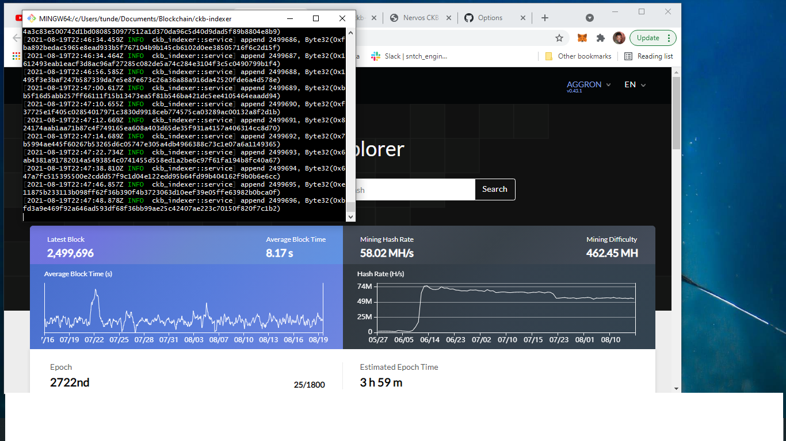
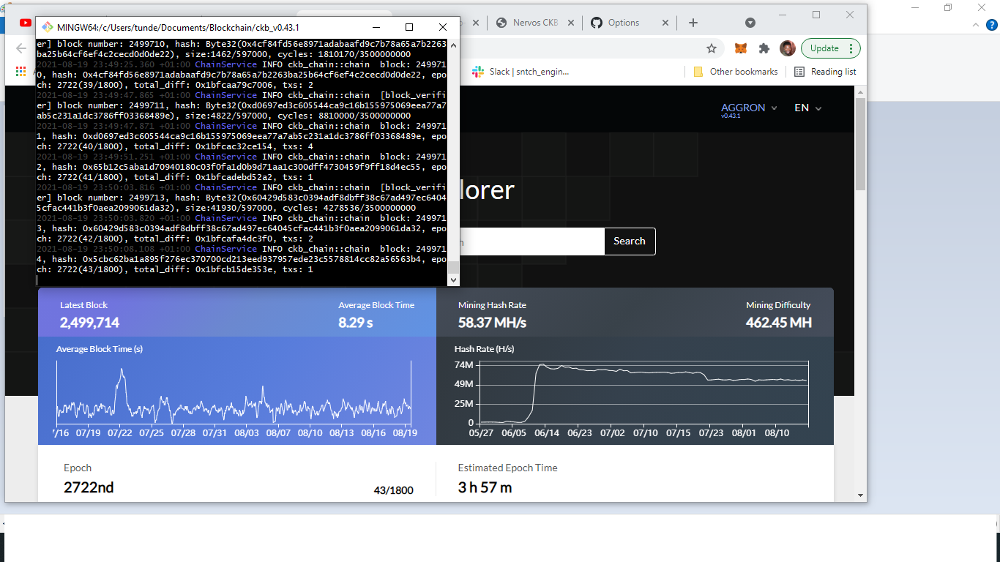

# Hackathon-Nervos-Gitcoin-0-Setup-A-Local-CKB-Node-And-CKB-Indexer-For-The-Testnet
>This is the first stage in the Nervos-Broaden The Spectrum hackathon hosted on Gitcoin.

## Table of contents
* [Screenshots](#screenshots)
* [Inspiration](#inspiration)
* [Contact](#contact)

## Screenshots

## Inspiration
Project inspired by [Nervos](https://gitcoin.co/issue/nervosnetwork/grants/1/100026176)

## Contact
Created by [@shocotee](https://twitter.com/shocotee) - feel free to contact me!
